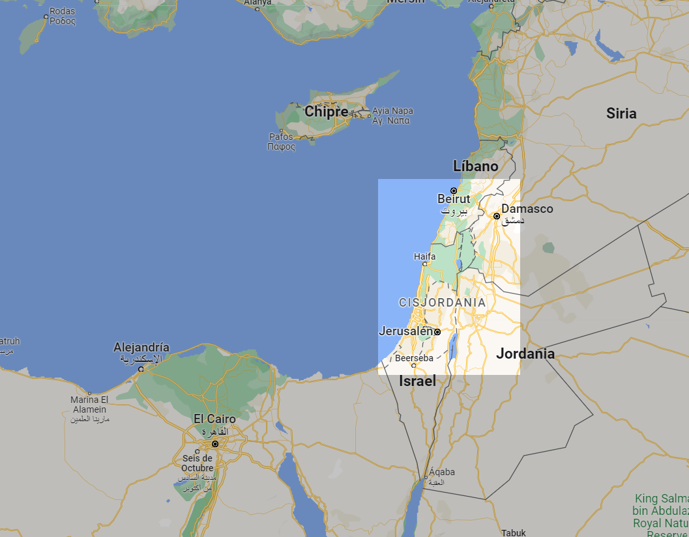
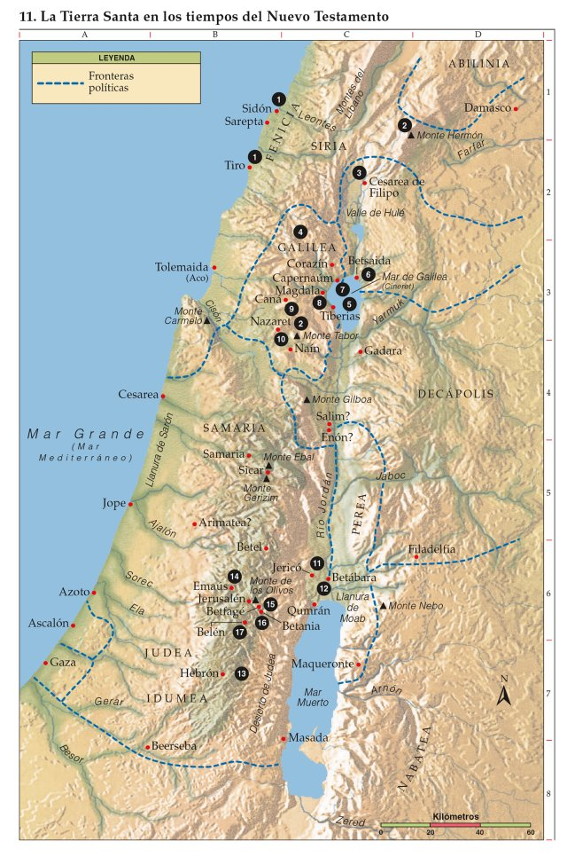

# Jesús de Nazaret - Mapa y lugares
Mapa de los lugares en los que existe constancia que estuvo Jesús de Nazaret

(*Palestina, Líbano y Siria*)

## Mapa actual (2023)

[Google Maps](https://www.google.com/maps/@32.4642945,31.8230922,6.59z)

## Tierra Santa - Nuevo Testamento

1.	**`Tiro y Sidón`**
* [Mateo 15:21-28](https://www.vatican.va/archive/ESL0506/__PUP.HTM) – Jesús sanó a la hija de una mujer cananea, que estaba atormentada por un demonio

2.	**`Monte de la Transfiguración`**
* [Marcos 9:2-13](https://www.vatican.va/archive/ESL0506/__PVB.HTM) – Jesús se transfiguró delante de Pedro, Santiago y Juan

3.	**`Cesarea de Filipo`** 
* [Mateo 16:13-20](https://www.vatican.va/archive/ESL0506/__PUQ.HTM) – Simón Pedro testificó que Jesús es el Mesías, el Hijo de Dios vivo. Jesús le dijo a Pedro que le daría las llaves del Reino de los Cielos
* [Mateo 16:21-28](https://www.vatican.va/archive/ESL0506/__PUQ.HTM) – Jesús predijo allí que debía ser condenado a muerte y resucitar al tercer día

4.	**`Región de Galilea`** 
* [Mateo 4:23-25](https://www.vatican.va/archive/ESL0506/__PUE.HTM) – Jesús pasó la mayor parte de su vida y ministerio recorriendo toda Galilea, enseñando en las sinagogas y proclamando la Buena Noticia del reino, curando enfermedades y dolencias a la gente, y su fama se extendió por toda Siria, le llevaban enfermos, endemoniados, epilépticos y paralíticos, y él los curaba
* [Mateo 5-7](https://www.vatican.va/archive/ESL0506/__PUF.HTM) – Jesús pronuncia el Sermón de la Montaña
* [Mateo 8:1-4](https://www.vatican.va/archive/ESL0506/__PUI.HTM) – Jesús sana a un leproso después de bajar de la montaña
* [Mateo 28:16-20](https://www.vatican.va/archive/ESL0506/__PV2.HTM) – Los once discípulos fueron a la montaña a la que Jesús resucitado los había citado, algunos con cierto recelo, y allí, Jesús les dijo: “Yo he recibido todo poder en el cielo y en la tierra”. Y les instó a que todos los pueblos fueran sus discípulos, y que los bauticen en el nombre del Padre, del Hijo y del Espíritu Santo

5.	**`Mar de Galilea (Mar de Tiberiades o Lago de Genesaret)`**
* [Mateo 4:18-22](https://www.vatican.va/archive/ESL0506/__PUE.HTM) – Jesús llamó a Pedro, a Andrés, a Santiago y a Juan para que fueran pescadores de hombres
* [Lucas 5:1-11](https://www.vatican.va/archive/ESL0506/__PVN.HTM) – Jesús instó a Simón Pedro a echar las redes para pescar, y éste junto a Santiago y Juan quedaron atemorizados por la cantidad de peces que sacaron. Jesús le dijo a Simón Pedro que no temiera, pues de ahora en adelante sería pescador de hombres
* [Lucas 8:22-25](https://www.vatican.va/archive/ESL0506/__PVQ.HTM) – Jesús calmó la tempestad
* [Mateo 13](https://www.vatican.va/archive/ESL0506/__PUN.HTM) – Jesús enseñó a la multitud por medio de parábolas
* [Mateo 14:22-32](https://www.vatican.va/archive/ESL0506/__PUO.HTM) – Jesús anduvo sobre el mar
* [Juan 21](https://www.vatican.va/archive/ESL0506/__PWR.HTM) – Jesús se apareció a sus discípulos por tercera vez después de su resurrección

6.	**`Betsaida`**
* [Lucas 9:10-17](https://www.vatican.va/archive/ESL0506/__PVR.HTM) y [Juan 6:1-14](https://www.vatican.va/archive/ESL0506/__PWC.HTM) – Jesús y los Apóstoles se retiraron para estar solos cerca de Betsaida. La multitud los siguió y Jesús les habló del Reino de Dios, curó a enfermos, y alimentó a alrededor de 5000 hombres
* [Marcos 8:22-26](https://www.vatican.va/archive/ESL0506/__PVA.HTM) – Jesús sanó a un ciego

7.	**`Cafarnaúm`**
* [Mateo 9:1-7](https://www.vatican.va/archive/ESL0506/__PUJ.HTM) – Jesús sanó a un paralítico
* [Mateo 8:5-15](https://www.vatican.va/archive/ESL0506/__PUI.HTM) – Jesús curó al criado de un centurión “Señor, no soy digno de que entres en mi casa, pero una palabra tuya, bastará para sanarle”. Jesús curó a la suegra de Pedro que tenía fiebre
* [Mateo 9:9](https://www.vatican.va/archive/ESL0506/__PUJ.HTM) – Jesús llamó a Mateo que estaba en la mesa de recaudación de impuestos y le dijo “Sígueme”. De esta manera, Mateo se integró como uno más de sus Apóstoles
* [Mateo 9:27-33](https://www.vatican.va/archive/ESL0506/__PUJ.HTM) – Jesús sanó a dos ciegos y a un mudo endemoniado
* [Juan 6:22-65](https://www.vatican.va/archive/ESL0506/__PWC.HTM) – Jesús pronuncia el discurso sobre el pan de vida “Yo soy el pan de Vida. El que viene a mí jamás tendrá hambre; el que cree en mí jamás tendrá sed”

8.	**`Magdala (lugar de procedencia de María Magdalena)`**
* [Mateo 16:1-4](https://www.vatican.va/archive/ESL0506/__PUQ.HTM) – Los fariseos y saduceos le pidieron a Jesús que les mostrase una señal del cielo

9.	**`Canaá`**
* [Juan 2:1-11](https://www.vatican.va/archive/ESL0506/__PW8.HTM) – Jesús convirtió el agua en vino

10.	**`Nazaret`**
* [Mateo 1:18-25](https://www.vatican.va/archive/ESL0506/__PUB.HTM), [Lucas 1:26-38](https://www.vatican.va/archive/ESL0506/__PVJ.HTM) y [Lucas 2:4-5](https://www.vatican.va/archive/ESL0506/__PVK.HTM) – Anunciaciones a María y a José
* [Mateo 2:19-23](https://www.vatican.va/archive/ESL0506/__PUC.HTM) – José fue advertido en sueños para que abandonara Egipto y fuera a Israel. Pero advertido en sueños, llevó a Jesús a Nazaret

11.	**`Jericó`**
* [Lucas 18:35-43](https://www.vatican.va/archive/ESL0506/__PW0.HTM) – Jesús sana la vista a un ciego

12.	**`Betábara`**
* [Juan 1:19-28](https://www.vatican.va/archive/ESL0506/__PW7.HTM) – En este lugar, Juan el Bautista testificó que él no era el Mesías, pero sí la voz que grita en el desierto. Allanen el camino del Señor, como dijo el profeta Isaías

13.	**`Desierto de Judea`**
* [Mateo 4:1-11](https://www.vatican.va/archive/ESL0506/__PUE.HTM) – Jesús ayunó cuarenta días y cuarenta noches, y fue tentado por el demonio

14.	**`Emaús`**
* [Lucas 24:13-32](https://www.vatican.va/archive/ESL0506/__PW6.HTM) – Jesús resucitado se acercó a dos de sus discípulos y caminó junto a ellos por el camino de Emaús a 10 kilómetros de Jerusalén

15.	**`Betfagé y Monte de los Olivos`**
* [Mateo 21:1-11](https://www.vatican.va/archive/ESL0506/__PUV.HTM) – Jesús inicia su entrada triunfal en Jerusalén

16.	**`Betania`**
* [Juan 11:1-45](https://www.vatican.va/archive/ESL0506/__PWH.HTM) – Ciudad de María, su hermana Marta y Lázaro, a 3 kilómetros de Jerusalén. Jesús resucita a Lázaro de entre los muertos
* [Mateo 26:6-13](https://www.vatican.va/archive/ESL0506/__PV0.HTM) y [Juan 12:1-8](https://www.vatican.va/archive/ESL0506/__PWI.HTM) – María unge los pies de Jesús con una libra de perfume de nardo puro, y los seca con sus cabellos

17.	**`Belén`**
* [Lucas 2:1-7](https://www.vatican.va/archive/ESL0506/__PVK.HTM) – Jesús nació en Belén

---

## Referencias
* La idea de aglutinar la información, [surgió a partir de este tweet de Carlos Paz](https://twitter.com/CarlosPazC2021/status/1643141939665969152?s=20), sobre el que he recogido, ampliado o rectificado alguna información
* [Referencia - Biblia - El libro del pueblo de Dios (traducción Argentina 1990) - El Vaticano](https://www.vatican.va/archive/ESL0506/_INDEX.HTM)
